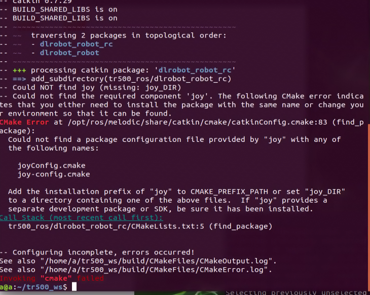

# tanke 履带车

CSU-RM

https://github.com/baiyeweiguang/CSU-RM-Sentry

[baiyeweiguang/CSU-RM-Sentry | DeepWiki](https://deepwiki.com/baiyeweiguang/CSU-RM-Sentry/1-overview)

起名字规定

```ini

机器狗：navdg_ws + doge_xxx
履带车：navtk_ws + tanke_xxx
```


IMU 有两个，

1. `/imu`：底盘自带的 IMU，频率 20Hz。
2. `/livox/imu`：Livox Mid-360 雷达内置的 IMU，频率约 200Hz。

```bash
tr500@tr500:~/navtk_ws/src/tanke_slam_nav/rviz$ rostopic hz /imu 
subscribed to [/imu]
average rate: 20.021
	min: 0.049s max: 0.050s std dev: 0.00018s window: 20
average rate: 20.008
	min: 0.049s max: 0.051s std dev: 0.00031s window: 40
^Caverage rate: 20.008
	min: 0.049s max: 0.051s std dev: 0.00031s window: 46
tr500@tr500:~/navtk_ws/src/tanke_slam_nav/rviz$ rostopic hz /livox/imu 
subscribed to [/livox/imu]
average rate: 199.775
	min: 0.002s max: 0.009s std dev: 0.00094s window: 200
average rate: 199.853
	min: 0.000s max: 0.015s std dev: 0.00106s window: 400
average rate: 199.919
	min: 0.000s max: 0.015s std dev: 0.00105s window: 600
^Caverage rate: 199.924
	min: 0.000s max: 0.015s std dev: 0.00106s window: 640
tr500@tr500:~/navtk_ws/src/tanke_slam_nav/rviz$   
```


建立工作空间

```bash
# 创建并初始化 tanke_ws 工作空间
mkdir -p ~/navtk_ws/src
cd ~/navtk_ws
catkin_make

# 添加环境变量（永久生效）
echo "source ~/navtk_ws/devel/setup.bash" >> ~/.bashrc
source ~/.bashrc

# 验证是否创建成功
echo $ROS_PACKAGE_PATH
```


将官方的两个 ROS1 的驱动包放到 src 目录下


出现的问题

> [!NOTE]
>
> ## ==**报错一**==
>
> **缺少 ROS 官方的 `joy` (游戏手柄 /joystick) 依赖包**。
>
> 直接复制下面这 **一行命令**，安装缺失的依赖，然后重新编译即可：
>
> ```bash
> sudo apt install ros-melodic-joy
> sudo apt install ros-noetic-joy
> ```
>
> 安装完成后，回到工作空间重新编译：
>
> ```bash
> cd ~/navtk_ws
> catkin_make
> ```
>
> ### 问题原因
>
> 你的 tanke 驱动包 (`dlrobot_robot_rc`) 需要用到 **手柄控制** 功能，但是你的系统里没有安装 ROS 的手柄驱动库。
>
> ### 总结
>
> 1. 运行 `sudo apt install ros-melodic-joy` 安装依赖。
> 2. 重新运行 `catkin_make` 编译，问题解决。
>
> 


